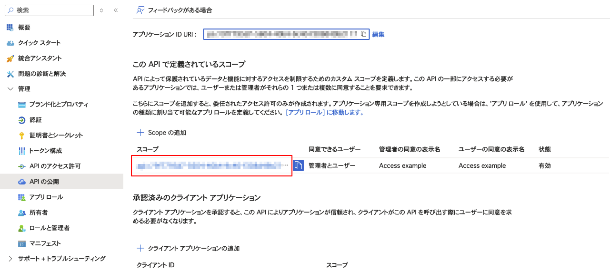

# App Service + Entra ID で Resource Owner Password Credentials Flow を行う

## モチベーション

App Serviceで動かしているアプリケーションの認証をEntra IDで行う際、CLIでアクセスするためResource Owner Password Credentials Flowを有効化したい。

## 前提

デフォルトの状態（？）で認証設定は終えており、ウェブブラウザーでは認証を行なってアプリケーションが見られる状態であること。

## 設定方法

Resource Owner Password Credentials Flowを有効化する手順は次の通り。

- Entra IDの「アプリの登録」から該当のアプリを選択
- 「認証」のメニューを選択
- 「次のモバイルとデスクトップのフローを有効にする:」で「はい」を選択
- 保存する


## 動作確認

次の手順で認証およびアプリケーションへのアクセスを行う。

- トークンエンドポイントに対してパスワードで認証を行い、アクセストークンを取得する
- アクセストークンをリクエストヘッダーに設定し、アプリケーションへアクセスする

### 必要な情報を集める

まずAzureポータルから必要な情報を集める。

「概要」から「クライアントID」と「テナントID」を取得する。


「APIの公開」から「スコープ」を取得する。



### トークンエンドポイントに対してパスワードで認証を行い、アクセストークンを取得する

次のコマンドでアクセストークンを取得できる。

```bash
curl -X POST -d 'grant_type=password' \
     -d 'client_id=$CLIENT_ID' \
     -d 'username=$USERNAME' \
     -d 'password=$PASSWORD' \
     -d 'scope=$SCOPE' \
     https://login.microsoftonline.com/$TENANT_ID/oauth2/v2.0/token
```

コマンドに含まれる環境変数の意味は次の通り。

|環境変数名|説明|
|---|---|
|`CLIENT_ID`|前セクションで収集した「クライアントID」|
|`USERNAME`|アプリケーションへアクセスするユーザーのユーザー名|
|`PASSWORD`|アプリケーションへアクセスするユーザーのパスワード|
|`SCOPE`|前セクションで収集した「スコープ」|
|`TENANT_ID`|前セクションで収集した「テナントID」|

次のようなレスポンスを得られる。

```json
{
  "token_type": "Bearer",
  "scope": "...",
  "expires_in": 4498,
  "ext_expires_in": 4498,
  "access_token": "eyJhbGciOi..."
}
```

`access_token`フィールドの値がアクセストークン。

### アクセストークンをリクエストヘッダーに設定し、アプリケーションへアクセスする

全セクションで得られたアクセストークンを`Authorization`リクエストヘッダーに設定し、アプリケーションへアクセスする。

```bash
curl -H "Authorization: Bearer eyJhbGciOi..." \
    https://example.com/
```

以上。