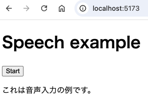

# Azure AI Speechを使用した音声入力の例

## Azure AI Speechの準備

リソースグループを作成する。

```bash
az group create \
  --name speech-example-rg \
  --location japanwest
```

音声認識サービスのリソースを作成する。

```bash
az cognitiveservices account create \
  --kind SpeechServices \
  --location japanwest \
  --name speech-example \
  --resource-group speech-example-rg \
  --sku F0 \
  --yes
```

サブスクリプションキーを取得。

```bash
az cognitiveservices account keys list \
  --name speech-example \
  --resource-group speech-example-rg | jq -r .key1
```

取得したサブスクリプションキーを`.env`へ記載する。

```
SPEECH_SUBSCRIPTION_KEY=<取得したサブスクリプションキー>
```

## アプリケーションの準備

バックエンドの準備。

```
poetry install
```

フロントエンドの準備。

```
cd ui
npm ci
```

## アプリケーションの起動

バックエンドの起動

```
poetry run fastapi dev
```

フロントエンドの起動

```
cd ui
npm run dev
```

## 動作確認

http://localhost:5173/ を開いて音声入力を試す。



## Azure AI Speechの後始末

リソースグループごと全て削除。

```bash
az group delete \
  --name speech-example-rg
```
