# コンテナのネットワークスタックを共有する例

`network_mode: "service:<サービス名>"`とすることでネットワークスタックを共有できるみたい。
[The Compose Specificationのnetwork\_mode](https://github.com/compose-spec/compose-spec/blob/master/spec.md#network_mode)を参照。

Composeではなく`docker run`での場合は過去に[Dockerで別のコンテナのネットワークスタックを共有する](https://zenn.dev/backpaper0/articles/2236d53294b7683d6d24)を書いた。

