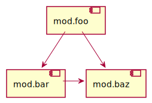

```sh
javac -d bin/baz src/baz/*.java
```

```sh
jar -cf lib/baz.jar -C bin/baz .
```

```sh
javac -d bin/bar -p lib src/bar/*.java
```

```sh
jar -cf lib/bar.jar -C bin/bar .
```

```sh
javac -d bin/foo -p lib src/foo/*.java
```

エラーが出る。

```
src/foo/Foo.java:4: エラー: パッケージcom.example.bazは表示不可です
import com.example.baz.Baz;
                  ^
  (パッケージcom.example.bazはモジュールmod.bazで宣言されていますが、モジュールmod.fooに読み込まれていません)
エラー1個
```

`mod.baz`へ依存していることを明示すればいい。
そのためには`src/foo/module-info.java`を次のように修正する。

```java
module mod.foo {
    requires mod.bar;
    requires mod.baz;
}
```

再度コンパイルすると今度は成功する。

```sh
javac -d bin/foo -p lib src/foo/*.java
```

あるいは`mod.bar`の`module-info.java`で`mod.baz`の依存が推移的であると示してもいい。
そのためには`src/bar/module-info.java`を次のように修正する。

```java
module mod.bar {
    exports com.example.bar;
    requires transitive mod.baz;
}
```

こちらの修正でもコンパイルは成功する（もう一度`mod.bar`からビルドする）。

```sh
javac -d bin/bar -p lib src/bar/*.java
jar -cf lib/bar.jar -C bin/bar .
javac -d bin/foo -p lib src/foo/*.java
```

```sh
jar -cf lib/foo.jar -C bin/foo .
```

```sh
java -p lib -m mod.foo/com.example.foo.Foo
```

`jdeps`で依存関係を見てみる。

```sh
jdeps --module-path lib --module mod.foo
```

```
mod.foo
 [file:///path/to/sandbox/java-module/case3/lib/foo.jar]
   requires mandated java.base (@17)
   requires mod.bar
mod.foo -> java.base
mod.foo -> mod.bar
mod.foo -> mod.baz
   com.example.foo                                    -> com.example.bar                                    mod.bar
   com.example.foo                                    -> com.example.baz                                    mod.baz
   com.example.foo                                    -> java.io                                            java.base
   com.example.foo                                    -> java.lang                                          java.base
   com.example.foo                                    -> java.lang.invoke                                   java.base
```

`jlink`でカスタムランタイムイメージを作る。

```sh
jlink -p lib --add-modules mod.foo --output custom-jre
```

カスタムランタイムイメージを実行する。

```sh
$ ./custom-jre/bin/java -m mod.foo/com.example.foo.Foo
Foo, Bar, Baz
Foo, Baz
```

サイズを見てみる。

```
$ du -sh ./custom-jre
 54M    ./custom-jre
$ du -sh $JAVA_HOME
320M    /Library/Java/JavaVirtualMachines/liberica-jdk-17.jdk/Contents/Home
```