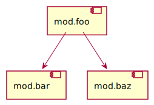

```sh
javac -d bin/baz src/baz/*.java
```

```sh
jar -cf lib/baz.jar -C bin/baz .
```

```sh
javac -d bin/bar src/bar/*.java
```

```sh
jar -cf lib/bar.jar -C bin/bar .
```

```sh
javac -d bin/foo -p lib src/foo/*.java
```

```sh
jar -cf lib/foo.jar -C bin/foo .
```

```sh
java -p lib -m mod.foo/com.example.foo.Foo
```

`jdeps`で依存関係を見てみる。

```sh
jdeps --module-path lib --module mod.foo -s
```

```
mod.foo -> baz
mod.foo -> java.base
mod.foo -> mod.bar
```
