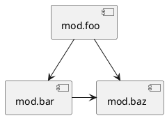
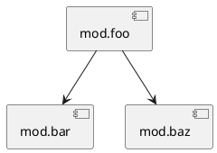

```plantuml
@startuml case1
[mod.foo] -> [mod.bar]
@enduml
```

```plantuml
@startuml case2
[mod.foo] -> [mod.bar]
[mod.bar] -> [mod.baz]
@enduml
```

```plantuml
@startuml case3
[mod.foo] --> [mod.bar]
[mod.foo] --> [mod.baz]
[mod.bar] -> [mod.baz]
@enduml
```

```plantuml
@startuml case4
[mod.foo] --> [mod.bar]
[mod.foo] --> [mod.baz]
@enduml
```
