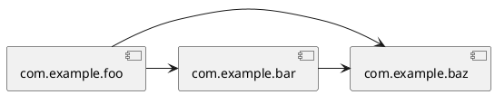

```plantuml
@startuml case1
[com.example.foo] -> [com.example.bar]
@enduml
```

```plantuml
@startuml case2
[com.example.foo] -> [com.example.bar]
[com.example.bar] -> [com.example.baz]
@enduml
```

```plantuml
@startuml case3
[com.example.foo] -> [com.example.bar]
[com.example.foo] -> [com.example.baz]
[com.example.bar] -> [com.example.baz]
@enduml
```
