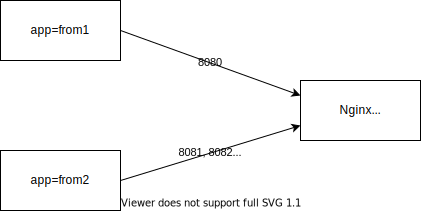

# ネットワークポリシー

ネットワークポリシーを試す。

次のような構成。

- ポート`8080`から`8084`で待ち受けるNginxを立てる
- `app=from1`というラベルを持つPodからはポート`8080`への接続を許可する
- `app=from2`というラベルを持つPodからはポート`8081`から`8083`までへの接続を許可する



## Kubernetesクラスターの構築

kindはデフォルトだとネットワークポリシーを扱えないので[Calico](https://projectcalico.docs.tigera.io/about/about-calico)をインストールする。

```bash
kind create cluster --config config.yaml
```

[Quickstart for Calico on Kubernetes](https://projectcalico.docs.tigera.io/getting-started/kubernetes/quickstart)を参考にしてCalicoをインストール。

```bash
kubectl create -f https://raw.githubusercontent.com/projectcalico/calico/v3.24.5/manifests/tigera-operator.yaml
```

```bash
kubectl create -f https://raw.githubusercontent.com/projectcalico/calico/v3.24.5/manifests/custom-resources.yaml
```

## Nginxをデプロイする

```bash
kubectl apply -f demo.yaml
```

## 動作確認

まず`app=from1`というラベルを持つPodを作成してNginxへHTTPリクエストを送信してみる。

```bash
kubectl run -it --rm test1 --image=nginx --labels=app=from1 bash
```

Podの中から`curl`でHTTPリクエストを送信する。

```bash
curl --connect-timeout 3 http://nginx:8080
```

他のポート(`8081`〜`8084`)だと接続タイムアウトになる。

次に`app=from2`というラベルを持つPodを作成してNginxへHTTPリクエストを送信してみる。

```bash
kubectl run -it --rm test2 --image=nginx --labels=app=from2 bash
```

先ほどと同じくPodの中から`curl`でHTTPリクエストを送信する。
ポート`8081`から`8083`までは接続でき、`8080`と`8084`は接続タイムアウトになることを確認する。

## 後始末

```bash
kind delete cluster
```

