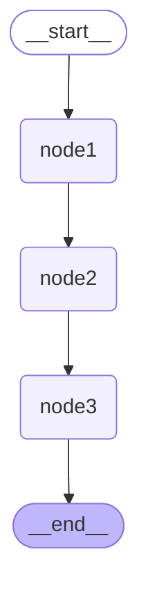
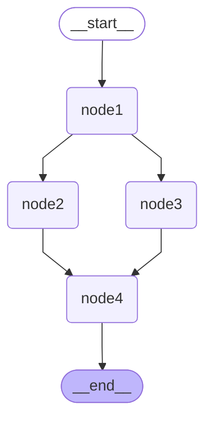

# LangGraphを試す

## example

### example1

```mermaid
%%{init: {'flowchart': {'curve': 'linear'}}}%%
graph TD;
        __start__([__start__]):::first
        node1(node1)
        node2(node2)
        node3(node3)
        __end__([__end__]):::last
        __start__ --> node1;
        node1 --> node2;
        node2 --> node3;
        node3 --> __end__;
        classDef default fill:#f2f0ff,line-height:1.2
        classDef first fill-opacity:0
        classDef last fill:#bfb6fc
```

### example2

```mermaid
%%{init: {'flowchart': {'curve': 'linear'}}}%%
graph TD;
        __start__([__start__]):::first
        node1(node1)
        node2(node2)
        node3(node3)
        node4(node4)
        __end__([__end__]):::last
        __start__ --> node1;
        node1 --> node2;
        node1 --> node3;
        node2 --> node4;
        node3 --> node4;
        node4 --> __end__;
        classDef default fill:#f2f0ff,line-height:1.2
        classDef first fill-opacity:0
        classDef last fill:#bfb6fc
```