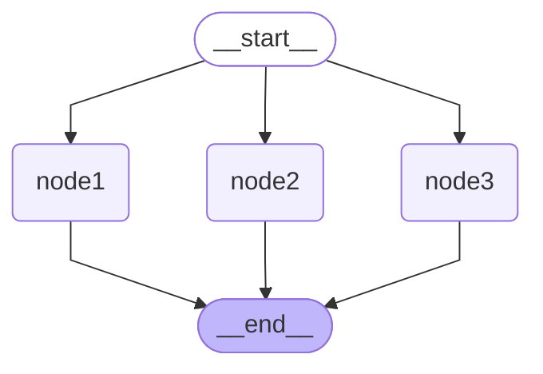
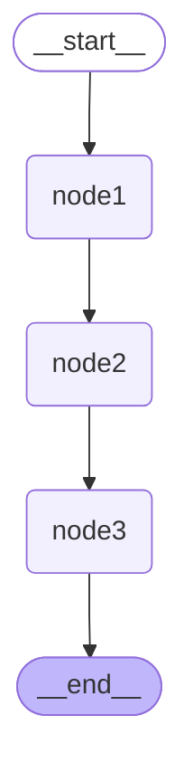

# Graph

## conditionoal branch

```mermaid
%%{init: {'flowchart': {'curve': 'linear'}}}%%
graph TD;
	__start__([<p>__start__</p>]):::first
	node1(node1)
	node2(node2)
	node3(node3)
	__end__([<p>__end__</p>]):::last
	__start__ --> node1;
	node2 --> __end__;
	node3 --> __end__;
	node1 -.-> node2;
	node1 -.-> node3;
	classDef default fill:#f2f0ff,line-height:1.2
	classDef first fill-opacity:0
	classDef last fill:#bfb6fc
```

## parallel

```mermaid
%%{init: {'flowchart': {'curve': 'linear'}}}%%
graph TD;
	__start__([<p>__start__</p>]):::first
	node1(node1)
	node2(node2)
	node3(node3)
	__end__([<p>__end__</p>]):::last
	__start__ --> node1;
	__start__ --> node2;
	__start__ --> node3;
	node1 --> __end__;
	node2 --> __end__;
	node3 --> __end__;
	classDef default fill:#f2f0ff,line-height:1.2
	classDef first fill-opacity:0
	classDef last fill:#bfb6fc
```

## simple

```mermaid
%%{init: {'flowchart': {'curve': 'linear'}}}%%
graph TD;
	__start__([<p>__start__</p>]):::first
	node1(node1)
	node2(node2)
	node3(node3)
	__end__([<p>__end__</p>]):::last
	__start__ --> node1;
	node1 --> node2;
	node2 --> node3;
	node3 --> __end__;
	classDef default fill:#f2f0ff,line-height:1.2
	classDef first fill-opacity:0
	classDef last fill:#bfb6fc
```
