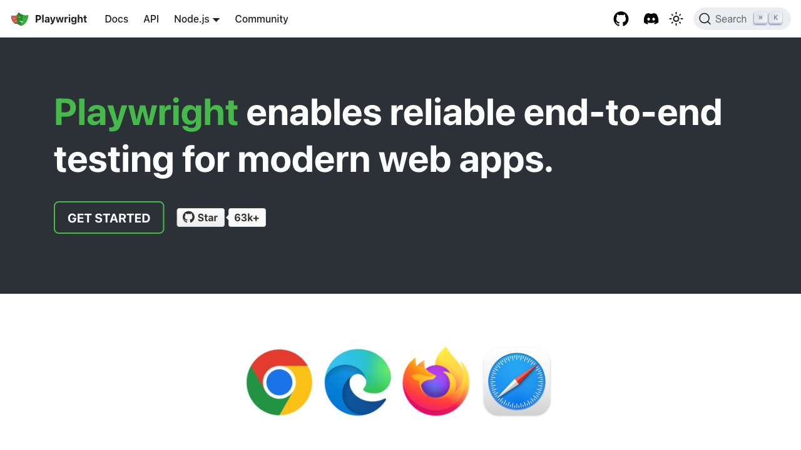
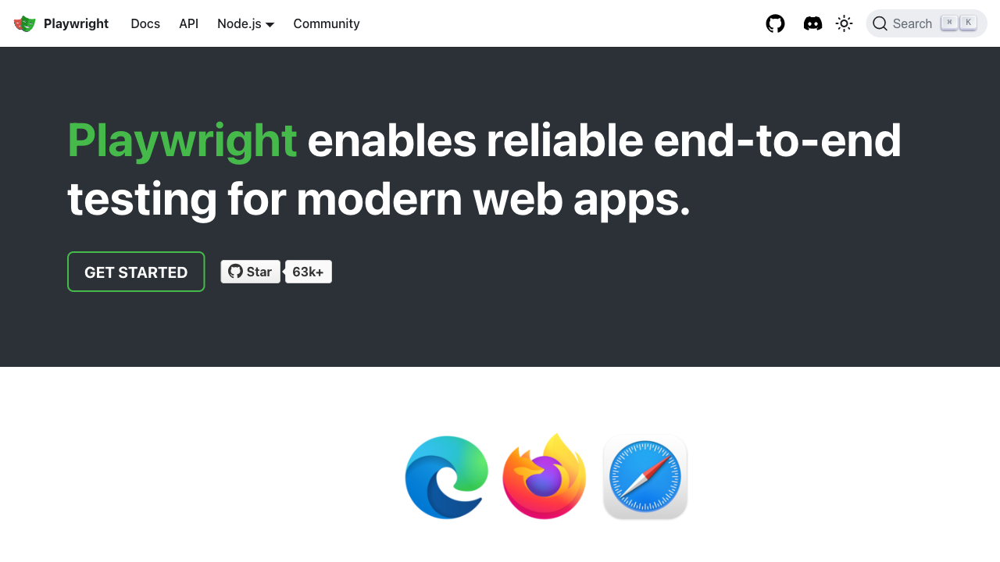
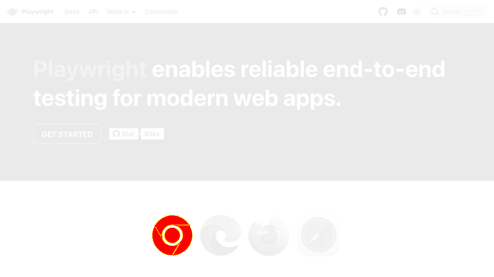

Playwrightの[Visual comparisons](https://playwright.dev/docs/test-snapshots)を試す。

まずは比較用のスクリーンショットを取得する。

```bash
npx playwright test --update-snapshots
```

次に開発が進んだと仮定して、ビジュアルリグレッションテストを含むテストを実行する。

```bash
npx playwright test
```

わざと編集した画像でスナップショットを置き換えてテストを実行してみた。

元の画像。



編集した画像。



`test-results`ディレクトリ以下に出力された画像の差分。

