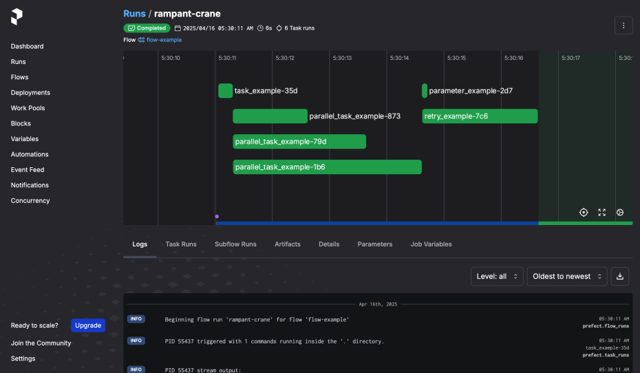

# prefect-example

[prefect](https://docs.prefect.io/)でジョブフローを組んで実行する例です。

## 実行方法

prefectのサーバーを開始します。

```bash
uv run task prefect
```

ウェブブラウザで http://localhost:4200 を開きます。

[main.py](./main.py)を実行します。

```bash
uv run task main
```

実行ログは次の通り。

```
05:30:09.919 | INFO    | prefect - Starting temporary server on http://127.0.0.1:8406
See https://docs.prefect.io/3.0/manage/self-host#self-host-a-prefect-server for more information on running a dedicated Prefect server.
05:30:11.046 | INFO    | Flow run 'rampant-crane' - Beginning flow run 'rampant-crane' for flow 'flow-example'
05:30:11.064 | INFO    | Task run 'task_example-35d' - PID 55437 triggered with 1 commands running inside the '.' directory.
05:30:11.240 | INFO    | Task run 'task_example-35d' - PID 55437 stream output:

Hello from Docker!
This message shows that your installation appears to be working correctly.

To generate this message, Docker took the following steps:
 1. The Docker client contacted the Docker daemon.
 2. The Docker daemon pulled the "hello-world" image from the Docker Hub.
    (arm64v8)
 3. The Docker daemon created a new container from that image which runs the
    executable that produces the output you are currently reading.
 4. The Docker daemon streamed that output to the Docker client, which sent it
    to your terminal.

To try something more ambitious, you can run an Ubuntu container with:
 $ docker run -it ubuntu bash

Share images, automate workflows, and more with a free Docker ID:
 https://hub.docker.com/

For more examples and ideas, visit:
 https://docs.docker.com/get-started/
05:30:11.310 | INFO    | Task run 'task_example-35d' - PID 55437 completed with return code 0.
05:30:11.311 | INFO    | Task run 'task_example-35d' - Successfully closed all open processes.
05:30:11.312 | INFO    | Task run 'task_example-35d' - Finished in state Completed()
05:30:11.331 | INFO    | Task run 'parallel_task_example-873' - PID 55444 triggered with 1 commands running inside the '.' directory.
05:30:11.332 | INFO    | Task run 'parallel_task_example-79d' - PID 55445 triggered with 1 commands running inside the '.' directory.
05:30:11.332 | INFO    | Task run 'parallel_task_example-1b6' - PID 55447 triggered with 1 commands running inside the '.' directory.
05:30:12.616 | INFO    | Task run 'parallel_task_example-873' - PID 55444 completed with return code 0.
05:30:12.619 | INFO    | Task run 'parallel_task_example-873' - Successfully closed all open processes.
05:30:12.621 | INFO    | Task run 'parallel_task_example-873' - Finished in state Completed()
05:30:13.639 | INFO    | Task run 'parallel_task_example-79d' - PID 55445 completed with return code 0.
05:30:13.642 | INFO    | Task run 'parallel_task_example-79d' - Successfully closed all open processes.
05:30:13.644 | INFO    | Task run 'parallel_task_example-79d' - Finished in state Completed()
05:30:14.613 | INFO    | Task run 'parallel_task_example-1b6' - PID 55447 completed with return code 0.
05:30:14.615 | INFO    | Task run 'parallel_task_example-1b6' - Successfully closed all open processes.
05:30:14.617 | INFO    | Task run 'parallel_task_example-1b6' - Finished in state Completed()
05:30:14.622 | INFO    | Task run 'parameter_example-2d7' - Parameter: foo='hello' bar=42 baz=True
05:30:14.622 | INFO    | Task run 'parameter_example-2d7' - Parameter Type: <class '__main__.MyParameter'>
05:30:14.624 | INFO    | Task run 'parameter_example-2d7' - Finished in state Completed()
05:30:14.627 | INFO    | Task run 'retry_example-7c6' - Count: 1
05:30:14.629 | INFO    | Task run 'retry_example-7c6' - Task run failed with exception: Exception('Retrying...') - Retry 1/5 will start 1 second(s) from now
05:30:15.634 | INFO    | Task run 'retry_example-7c6' - Count: 2
05:30:15.637 | INFO    | Task run 'retry_example-7c6' - Task run failed with exception: Exception('Retrying...') - Retry 2/5 will start 1 second(s) from now
05:30:16.642 | INFO    | Task run 'retry_example-7c6' - Count: 3
05:30:16.644 | INFO    | Task run 'retry_example-7c6' - Success!
05:30:16.646 | INFO    | Task run 'retry_example-7c6' - Finished in state Completed()
05:30:16.671 | INFO    | Flow run 'rampant-crane' - Finished in state Completed()
05:30:16.677 | INFO    | prefect - Stopping temporary server on http://127.0.0.1:8406
```

ウェブコンソールでも実行結果を確認できます。

