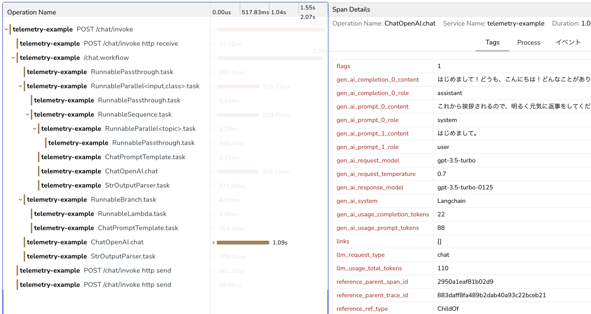
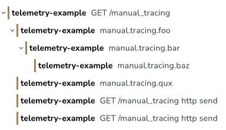
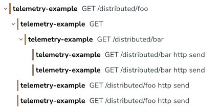

# python-opentelemetry-example

## 動作確認

[OpenObserve](https://openobserve.ai/)を起動する。

```
docker compose up -d
```

アプリケーションを起動する。

```
fastapi dev
```

http://localhost:8000/docs を開いて適当にリクエストを送信する。

OpenObserveでテレメトリーを確認する。

- http://localhost:5080
- [OrbStack](https://orbstack.dev/)を使っている場合は https://openobserve.python-opentelemetry-example.orb.local

ユーザー名とパスワードは次の通り。

- ユーザー名：`root@example.com`
- パスワード：`pass1234`

### LangChain

[OpenTelemetry Langchain Instrumentation](https://github.com/traceloop/openllmetry/tree/main/packages/opentelemetry-instrumentation-langchain)で[LangChain](https://www.langchain.com/)のトレースを記録する。

挨拶。

```
curl localhost:8000/chat/invoke -H "Content-Type: application/json" -d '{"input":"はじめまして。"}'
```

質問。

```
curl localhost:8000/chat/invoke -H "Content-Type: application/json" -d '{"input":"FastAPIについて教えて。"}'
```

その他。

```
curl localhost:8000/chat/invoke -H "Content-Type: application/json" -d '{"input":"うひょー"}'
```



### 手動トレーシング

```python
@router.get("/manual_tracing")
async def manual_tracing():
    tracer = trace.get_tracer("manual.tracer")
    with tracer.start_as_current_span("manual.tracing.foo") as span1:
        span1.set_attribute("foobar", "foo")
        with tracer.start_as_current_span("manual.tracing.bar") as span2:
            span2.set_attribute("foobar", "bar")
            with tracer.start_as_current_span("manual.tracing.baz") as span3:
                span3.set_attribute("foobar", "baz")
    with tracer.start_as_current_span("manual.tracing.qux") as span4:
        span4.set_attribute("foobar", "qux")
        return {"message": "Manual Tracing"}
```



### 複数のサービスにまたがるトレーシング（分散トレーシング）

```
curl localhost:8000/distributed/foo
```


