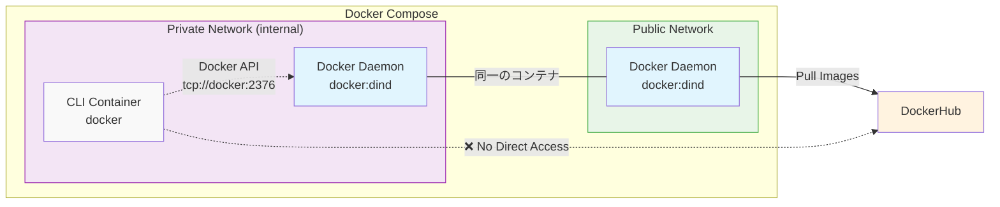

# Remote Docker Daemon Example

## 概要

`docker`コマンドで別マシンにあるDockerデーモンを使用する例です。
Docker Composeを使用して例示しています。`cli`コンテナが`docker`コンテナ内のDockerデーモンを使用しています。`cli`コンテナは直接コンテナイメージをダウンロードしていないことをわかりやすく示すため、`cli`コンテナはinternalなネットワークのみに所属させています。

## 構成

### アーキテクチャ図



### コンテナ構成

- **dockerコンテナ**: Docker-in-Docker (DinD) を実行し、Dockerデーモンを提供
  - イメージ: `docker:dind`
  - ネットワーク: `private`（内部）、`public`（外部アクセス用）
  - 特権モード: 有効

- **cliコンテナ**: Docker CLIクライアント
  - イメージ: `docker`
  - ネットワーク: `private`（内部のみ）
  - Docker接続: `tcp://docker:2376`（TLS有効）

### ネットワーク構成

- **privateネットワーク**: 内部通信用（`internal: true`）
- **publicネットワーク**: DockerHubへのアクセス用

## 動作確認手順

1. **環境を起動**
   ```bash
   docker compose up -d
   ```

2. **CLIコンテナに接続**
   ```bash
   docker compose exec cli sh
   ```

3. **Dockerの動作確認**
   CLIコンテナ内で以下のコマンドを実行：
   ```bash
   # Docker情報を表示
   docker info

   # イメージの一覧を表示
   docker images

   # テスト用イメージを取得
   docker pull hello-world

   # コンテナを実行
   docker run hello-world

   # 実行中のコンテナを確認
   docker ps -a
   ```

4. **環境を停止**
   ```bash
   docker compose down
   ```

## 備考

- `cli`コンテナは外部ネットワークへの直接アクセスができないため、イメージのpullは全て`docker`コンテナ経由で行われます
- TLS証明書は共有ボリュームを通じて管理されています
- Dockerデーモンのデータは永続化ボリュームに保存されます